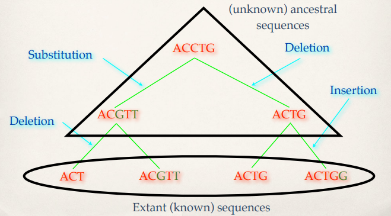
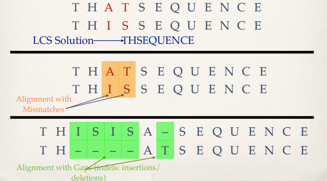

# Proteins-Similarity
探索人类眼睛控制基因与果蝇眼睛控制基因之间的相似性。

物种的进化中伴随着基因的突变过程。尽管如此，在不同的物种中，许多功能相同的基因依然保持着相似性。这是因为它们在几百万年以前都来源于同一个祖先。

通过序列对齐，可以快速的分析两个基因序列之间的相似性。这里主要用到了Global Pairwise Alignment和Local Pairwise Alignment算法。

## 人类眼睛控制蛋白质序列与果蝇眼睛控制蛋白质序列的相似性比较
* 人类眼睛控制蛋白质序列：http://storage.googleapis.com/codeskulptor-alg/alg_HumanEyelessProtein.txt
* 果蝇眼睛控制蛋白质序列：http://storage.googleapis.com/codeskulptor-alg/alg_FruitflyEyelessProtein.txt

* local alignment得分：875
* HumanEyelessProtein local alignment序列: 'HSGVNQLGGVFVNGRPLPDSTRQKIVELAHSGARPCDISRILQVSNGCVSKILGRYYETGSIRPRAIGGSKPRVATPEVVSKIAQYKRECPSIFAWEIRDRLLSEGVCTNDNIPSVSSINRVLRNLASEK-QQ'
* FruitflyEyelessProtein local alignment序列: 'HSGVNQLGGVFVGGRPLPDSTRQKIVELAHSGARPCDISRILQVSNGCVSKILGRYYETGSIRPRAIGGSKPRVATAEVVSKISQYKRECPSIFAWEIRDRLLQENVCTNDNIPSVSSINRVLRNLAAQKEQQ'

## 单词拼写检查（拓展应用）
测量两字符串序列之间的相似性还可用于单词拼写检查上。通过测量两字符串之间的编辑距离可以查验单词是否拼写正确，或者检查论文是否有抄袭的嫌疑。
* 字典：http://storage.googleapis.com/codeskulptor-assets/assets_scrabble_words3.txt

参考链接：
* https://storage.googleapis.com/codeskulptor-alg/pdf/SequenceAlignment.pdf
* https://en.wikipedia.org/wiki/Longest_common_subsequence_problem
* https://en.wikipedia.org/wiki/Edit_distance
